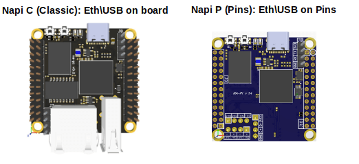

# Система сборки Debian для Napi-C, Napi-P, Napi-Slot (RK3308)

Система сборки образов Debian для плат на базе SoC Rockchip RK3308 (arm64):
- [Napi-C, Napi-P](https://github.com/napilab/napi-boards/blob/main/napic/README.md)
- [Napi-Slot](https://github.com/napilab/napi-boards/tree/main/napi-slot)



Результат сборки — загрузочный образ диска `.img.xz` с:
- U-Boot для RK3308
- Кастомным ядром Linux 6.6 с патчами Rockchip
- Заголовочными файлами ядра (headers) с нативными arm64 скриптами для сборки модулей на плате
- Базовой системой Debian (trixie) с предустановленными пакетами

---

## Требования к хосту

- Linux x86_64
- Запуск от root (`sudo`)
- Пакеты `debootstrap`, `qemu-user-static`, `binfmt-support`, `parted`, `xz-utils` — устанавливаются автоматически при запуске сборки
- `gcc-aarch64-linux-gnu`, `libc6:arm64` — необходимы для сборки ядра с нативными arm64 headers

---

## Готовые образы

Готовые образы для прошивки доступны по ссылке:
**<https://download.napilinux.ru/linuximg/napic/debian/>**

---

## Быстрый старт

```bash
git clone <url>
cd napi-debian-build
sudo ./mkimg.sh
```

Готовый образ окажется в `artifacts-trixie/`.

---

## Опции сборки

```bash
sudo ./mkimg.sh [опции]
```

| Опция | Описание |
|---|---|
| `--build-kernel` | Собрать ядро из исходников перед сборкой образа |
| `--branch=rk-6.6` | Ветка ядра (ищет `.deb` в `kernel-<branch>/`) |
| `--skip-uboot` | Не прошивать U-Boot (только rootfs) |
| `--skip-xz` | Не сжимать образ (быстрее, файл больше) |

### Переменные окружения

```bash
IMAGE_SIZE=2048       # Размер образа, МБ (по умолчанию 2048)
DISTRIBUTION=trixie   # Debian-дистрибутив
HOSTNAME_TARGET=napic # Имя хоста в образе
EXTRA_PKGS=mc,htop    # Дополнительные пакеты
KERNEL_VER=6.6.89     # Версия ядра (обычно определяется автоматически)
```

Пример:

```bash
sudo IMAGE_SIZE=4096 EXTRA_PKGS=mc,htop ./mkimg.sh --skip-xz
```

---

## Структура репозитория

```
config.sh              — вся конфигурация и вспомогательные функции
mkimg.sh               — точка входа, запускает pipeline
packages.list          — список пакетов для установки в образ
fix-headers.sh         — перепаковка headers deb с arm64 скриптами
napi-archive-keyring.asc — GPG-ключ репозитория deb.napilab.net

kernel-rk-6.6/        — готовые .deb с ядром и headers
uboot/                 — готовый .deb с U-Boot для Napi-C

scripts/
  00-build-kernel.sh   — сборка ядра из исходников (только с --build-kernel)
  01-create-image.sh   — создание .img, разметка, форматирование ext4
  02-debootstrap.sh    — установка базовой системы Debian в rootfs
  03-install-kernel.sh — установка ядра, headers, DTB в rootfs
  04-boot-config.sh    — генерация uEnv.txt, boot.cmd, boot.scr
  05-configure.sh      — настройка системы: пакеты, пользователь, локаль, SSH
  06-cleanup.sh        — размонтирование и очистка
  07-install-uboot.sh  — прошивка U-Boot в образ, сжатие xz
```

---

## Репозитории APT в образе

В образ автоматически подключаются два дополнительных репозитория:

**deb.napilab.net** — основной репозиторий Napi с ядром и системными пакетами.

**repo.napilab.ru** — репозиторий с утилитами для промышленных протоколов:

| Пакет | Описание |
|---|---|
| `mbusd` | Modbus RTU → TCP шлюз |
| `mbscan` | Сканер Modbus-устройств |
| `modbus-slave` | Modbus-slave эмулятор |

---

## Добавление пакетов в образ

Отредактируйте `packages.list` — один пакет на строку, комментарии через `#`:

```
# packages.list
mosquitto
mosquitto-clients
i2c-tools
```

---

## Сборка ядра из исходников

Если нужно пересобрать ядро:

```bash
sudo ./mkimg.sh --build-kernel
```

Скрипт склонирует репозиторий ядра в `kernel-src/`, соберёт `.deb`-пакеты кросс-компилятором `aarch64-linux-gnu-gcc` и положит их в `kernel-rk-6.6/`.

Репозиторий ядра: `https://gitlab.nnz-ipc.net/pub/napilinux/kernel.git`, ветка `rk-6.6`.

### Заголовочные файлы ядра (headers) с arm64 скриптами

При сборке с `--build-kernel` система автоматически перепаковывает `linux-headers` `.deb`, заменяя все служебные бинарники в `scripts/` (`fixdep`, `conf`, `modpost`, `kallsyms` и др.) на версии, скомпилированные для arm64 вместо x86_64. Это позволяет собирать внешние модули ядра (DKMS, драйверы Wi-Fi и т.д.) прямо на плате без кросс-компиляции.

Для перепаковки на хосте требуются `libc6:arm64` и `qemu-user-static` — устанавливаются автоматически при их отсутствии.

Для ручной перепаковки существующего headers `.deb` используйте вспомогательный скрипт:

```bash
sudo bash fix-headers.sh
```

### Проверка headers на плате

После установки образа или пакета headers убедитесь, что скрипты нативные arm64:

```bash
file /lib/modules/$(uname -r)/build/scripts/basic/fixdep
# Ожидается: ELF 64-bit LSB pie executable, ARM aarch64, ...
```

---

## Первый запуск на плате

При первой загрузке образ автоматически расширяет раздел на весь объём накопителя и перезагружается.

Доступ по SSH:
- Пользователь: `napi` / пароль: `napilinux`
- Пользователь: `root` / пароль: `napilinux`  